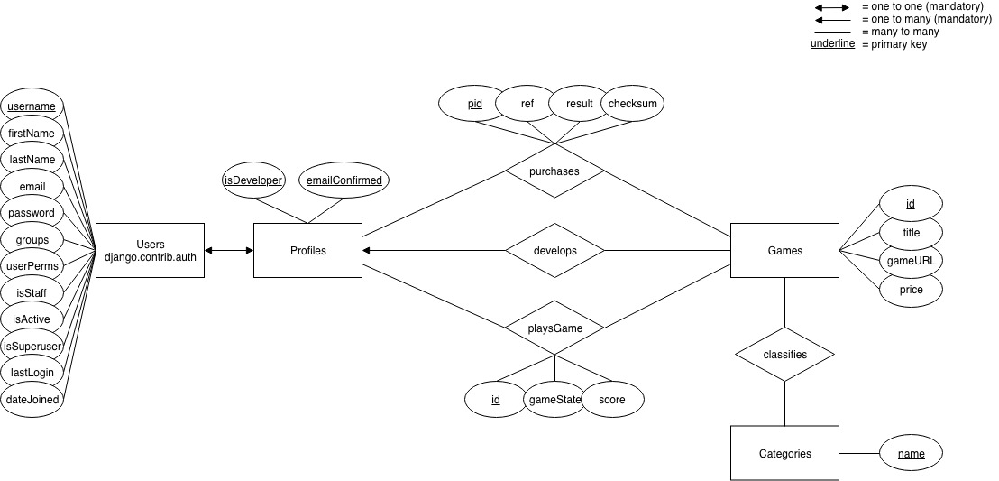
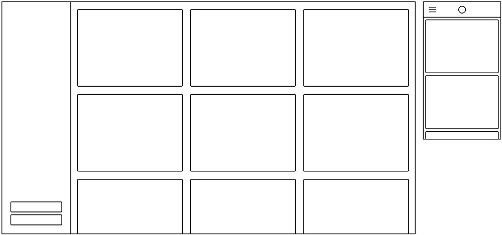

# Django Game Store Project Plan

## 1. Team

* 543693 Kenneth Forsman
* k84823 Olli Mustakallio
* 369181 Otso Teperi

## 2. Goal

The topic for the course project for CS-C3170 2018-2019 is an online game store for JavaScript games. The service has two types of users: players and developers. Developers can add their games to the service and set a price for it. Players can buy games on the platform and then play purchased games online.

## 3. Plans

We will use agile methods and a Kanban board (Trello) to manage work.
Meetings will be held on demand, while most communication will happen on Slack.
We will use Git repository for version control and deploy on Heroku.

For the front-end we plan to use Django templating, HTML5, SCSS, JavaScript, Bootstrap and jQuery.
For the middleware we have planned to use Express framework with NodeJS to create a RESTful API.
Database will be PostgreSQL.

### 3.1. Features to implement

1. Authentication
    * Authentication will be done with Django Authentication.
    * Validation will use emails, using the Django email validation.
    * For extra points we will try and create a Django REST API using Django REST Framework and JWT for added security.

2. Basic player functionalities
    * Players are able to purchase and play games.
    * Players can browse games via the search games page and see which games are discounted.
    * Players can see their purchase history and high score for each game.
    * Players can only play games they have purchased or if games are marked as free.

3. Basic developer functionalities
    * Developers can submit games to the site using a form to register their game.
    * Developers can edit, delete the game they have added to the site.
    * Developers cannot register the same game twice.
    * Developers can monitor the sales of games have have listed.

4. Game/service interaction
    * Games are played via iframes that communicate with the service via postMessages.

5. Quality of Work
    * We will try to follow Django best practices to create a good site.

6. Non-functional requirements
    * When plans have changed we will update the Kanban board with new tasks and update the project plan.

7. Save/load and resolution feature (extra)
    * TBD

8. 3rd party login (OpenID, Google) (extra)
    * We plan to add the OpenID service to Django Auth or add it to Django REST Framework.

9. RESTful API (extra)
    * A RESTful API using NodeJS or Django REST Framework will be added to the site to tasks of communicating with the game services and browsing games.

10. Own game (extra)
    * We will create a simple Javascript game for the site to test it.

11. Mobile-Friendly (extra)
    * We will be using Bootstrap for the UI.

12. Social media sharing (extra)
    * TBD if we will add social sharing. One possibility is to use the [django-allauth](https://django-allauth.readthedocs.io/en/stable/) package.

### 3.2. Responsibilities & Tasks

* Olli Mustakallio - Project manager, Full Stack
* Kenneth Forsman - Back-end
* Otso Teperi - Front-end

Each member of the team will contribute to the project equally on all parts. However, they have been assigned specialties that they will mostly focus on.

### 3.3. Priorities

Our priorities will go roughly as follows: Functionality (& security), user experience, then user interface. We will prioritize working on mandatory components first to create a solid foundation. After all mandatory components are functional, we will start adding additional features. The end product should work well, feel great and look good.

### 3.4. Security

We have planned to use OpenID as the authentication service, we will be using JWT for user sessions.
A new key is generated per login and destroyed on logout. Each HTTP request will be validated.

For the web front-end we will follow Django security tips.
<https://docs.djangoproject.com/en/2.1/topics/security/>

HTTPS and SSL will not be included in this project due to it not being within the scope of the assignment (or possible for free on Heroku). However, in a real world scenario a secured connection would be considered mandatory. In such case, we would at minimum utilize a free Let's Encrypt certificate to ensure reasonable protection of sensitive information.

### 3.5. Django Model

#### Database version 0.2

#### Database version 0.1

| Users             | Games                 | Score             | Purchases             |
|-------------------|-----------------------|-------------------|-----------------------|
| Id (int32)        | id (int32)            | id(Users:id)      | id (Games:id)         |
| fname (string)    | title (string)        | score(int32)      | purchasedate (date)   |
| lname (string)    | imageURL (string)     | title(Game:title) | price (Games:price)   |
| password (string) | price (int32)         | date(date)        | user (Users:id)       |
| class (int32)     | developer (User:id)   |                   | title:(Games:title)   |
|                   | url (string)          |                   |                       |
|                   | genre (string)        |                   |                       |

### 3.6. Layout

## 4. Process and Time Schedule

* Week 49: Create project plan. Setup Git repository, Heroku, PostgreSQL, RESTful API.
* Week 50: Split work into small pieces, start working on them as a team or individually. Grab tickets from the Trello board. Group registration. (14.12.)
* Week 51: Prepare for Christmas and New Year. Hopefully a small prototype is ready at this phase. Project plan (21.12.)
* Week 52: Holidays.
* Week 1-3: Set up core features. Get a working prototype as soon as possible. Hopefully by the end, everything mandatory is ready and functional. Test on Heroku.
* Week 4-6: Add extra features. Make it better.
* Week 7: Check everything twice. Fix minor issues.
* Week 8: Push to production. Final submission. (19.2.)

### 4.1. Project Milestones

During the first phase, the mandatory specifications are completed. This phase ends with a test Heroku deployment. During the second phase, the extra functionality is added as per our agile planning. After each additional functionality 'sprint', a Heroku deployment should be made to assure a working project is available for review. This is repeated until the time is out.

## 5. Testing & Working in Git

Master branch is for release build and will only contain functioning code.
Each project member will fork the master branch into their own branch, and work in that branch until the code is working. Once the code is working it will be merged into the master branch.
Once enough working components are created, master branch will be deployed to Heroku.

Before merging components into master branch, components are tested and approved.

## 6. Risk Analysis

* Sickness
* Work & Other commitments
* Laziness
* Lack of experience
* Fail to test properly
* Miscommunication
* Hubris

## 7. Technical Notes

* URLs are placed in gamestore.urls
* All templates are in the templates directory and inherit layout.html (which contains the bootstrap container).
* Install django-widget-tweaks for the forms to render correctly with bootstrap classes (pip install django-widget-tweaks).
